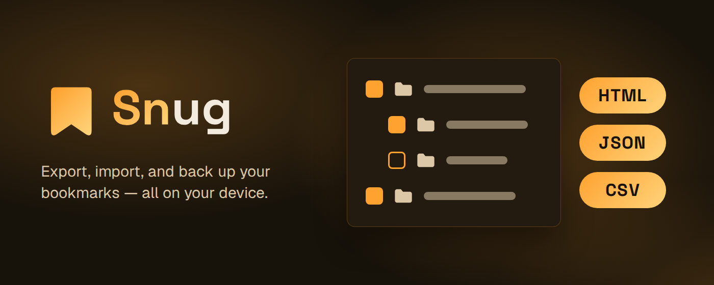

# Snug

[![Chrome Web Store Version][Chrome Web Store Version]][Chrome Web Store-url]
[![Chrome Web Store Users][Chrome Web Store Users]][Chrome Web Store-url]
[![CI][CI]][CI-url] [![License][License]][License-url]
[![OpenSSF Scorecard][OpenSSF Scorecard]][OpenSSF Scorecard-url]
[![OpenSSF Best Practices][OpenSSF Best Practices]][OpenSSF Best Practices-url]

Export, import, and back up your bookmarks — entirely on your device.

Snug is a browser extension that moves your bookmarks between browsers, exactly
as you left them. Export your whole tree or just a folder, in six formats.
Import back with a preview, then merge, replace, or drop everything into a new
folder, and undo a replace if you change your mind. Find and remove duplicate
bookmarks, and set a schedule once so Snug exports your bookmarks to your
Downloads folder on its own.

Snug makes no network calls. Every operation reads and writes your browser's own
bookmarks tree, locally — no account, no cloud, no server to trust. See the
[Privacy Policy](PRIVACY_POLICY.md) for details.

## Features

- Export bookmarks as HTML, JSON, CSV, Markdown, OPML, or XBEL.
- Import HTML, JSON, CSV, and XBEL files, a Chrome profile `Bookmarks` file, or
  a Safari export (Favorites and Reading List). The format is detected for you.
- Export your whole tree or only the folders you pick.
- Import with a preview first, then merge, replace, or add everything to a new
  folder. A replace shows how many bookmarks it removes and adds.
- Undo a replace: Snug saves a Safety snapshot first, and you can restore it
  from the import result or from Settings.
- Duplicates page to find bookmarks that share a URL and delete the extra
  copies, and Skip duplicates to leave them out of an import.
- Scheduled Auto-export (hourly, every 12 hours, daily, every 3 days, or weekly
  on a day you pick) to your Downloads folder, with Retention to keep only the
  newest files and an optional notification if a run fails.
- Progress and Cancel for long imports and exports.
- Follows your browser's theme and language, in 10 languages.

## Install

Install from the Chrome Web Store:

[![Chrome Web Store][Chrome Web Store]][Chrome Web Store-url]

Snug works on Chrome and any other Chromium-based browser (Edge, Opera, Brave)
from the same listing.

## Privacy

The [Privacy Policy](PRIVACY_POLICY.md) covers the permissions Snug requests and
why.

## Documentation

- [`docs/usage.md`](docs/usage.md) — exporting, importing, duplicates, and
  Auto-export.
- [`docs/development.md`](docs/development.md) — scripts, git hooks,
  commit/branch conventions, and how `fakeBrowser` testing works.
- [`docs/architecture.md`](docs/architecture.md) — a code map of the codebase's
  shape.
- [`CHANGELOG.md`](CHANGELOG.md) — release notes.
- [`CONTRIBUTING.md`](CONTRIBUTING.md) — pull request conventions.
- [`GOVERNANCE.md`](GOVERNANCE.md) — how the project is governed and how
  decisions get made.
- [`ROADMAP.md`](ROADMAP.md) — where the project is headed.
- [`.github/SECURITY.md`](.github/SECURITY.md) — how to report a security
  vulnerability privately.

**Built with**

[![WXT][WXT]][WXT-url] [![React][React]][React-url]
[![TailwindCSS][TailwindCSS]][TailwindCSS-url]
[![Shadcn/UI][Shadcn/UI]][Shadcn/UI-url] [![Lucide][Lucide]][Lucide-url]
[![TypeScript][TypeScript]][TypeScript-url]

## Local Development

See [`docs/development.md`](docs/development.md) for the rest.

```bash
git clone https://github.com/AndryOre/snug.git
cd snug
bun install
bun run dev
```

## Contributors

Contributions are welcome. See [`CONTRIBUTING.md`](CONTRIBUTING.md) for setup,
branch naming, and commit/PR conventions.

[](https://github.com/AndryOre/snug/graphs/contributors)

## License

This project is licensed under the MIT License. See the [LICENSE](LICENSE) file
for details.

[Chrome Web Store Version]:
  https://img.shields.io/chrome-web-store/v/gdhpeilfkeeajillmcncaelnppiakjhn?style=flat
[Chrome Web Store Users]:
  https://img.shields.io/chrome-web-store/users/gdhpeilfkeeajillmcncaelnppiakjhn?style=flat
[Chrome Web Store]:
  https://img.shields.io/badge/Chrome%20Web%20Store-4285F4.svg?style=flat&logo=Chrome-Web-Store&logoColor=white
[Chrome Web Store-url]:
  https://chromewebstore.google.com/detail/gdhpeilfkeeajillmcncaelnppiakjhn
[CI]:
  https://img.shields.io/github/actions/workflow/status/AndryOre/snug/ci.yml?branch=main&style=flat
[CI-url]: https://github.com/AndryOre/snug/actions/workflows/ci.yml
[License]: https://img.shields.io/github/license/AndryOre/snug?style=flat
[License-url]: LICENSE
[OpenSSF Scorecard]:
  https://api.securityscorecards.dev/projects/github.com/AndryOre/snug/badge
[OpenSSF Scorecard-url]:
  https://scorecard.dev/viewer/?uri=github.com/AndryOre/snug
[OpenSSF Best Practices]: https://www.bestpractices.dev/projects/15093/badge
[OpenSSF Best Practices-url]: https://www.bestpractices.dev/projects/15093
[WXT]:
  https://img.shields.io/badge/WXT-67D55E.svg?style=for-the-badge&logo=WXT&logoColor=white
[WXT-url]: https://wxt.dev/
[React]:
  https://img.shields.io/badge/React-61DAFB.svg?style=for-the-badge&logo=React&logoColor=black
[React-url]: https://react.dev/
[TailwindCSS]:
  https://img.shields.io/badge/Tailwind%20CSS-06B6D4.svg?style=for-the-badge&logo=Tailwind-CSS&logoColor=white
[TailwindCSS-url]: https://tailwindcss.com/
[Shadcn/UI]:
  https://img.shields.io/badge/shadcn%2Fui-000000.svg?style=for-the-badge&logo=shadcn%2Fui&logoColor=white
[Shadcn/UI-url]: https://ui.shadcn.com/
[Lucide]:
  https://img.shields.io/badge/Lucide-F56565.svg?style=for-the-badge&logo=Lucide&logoColor=white
[Lucide-url]: https://lucide.dev/
[TypeScript]:
  https://img.shields.io/badge/TypeScript-3178C6.svg?style=for-the-badge&logo=TypeScript&logoColor=white
[TypeScript-url]: https://www.typescriptlang.org/
